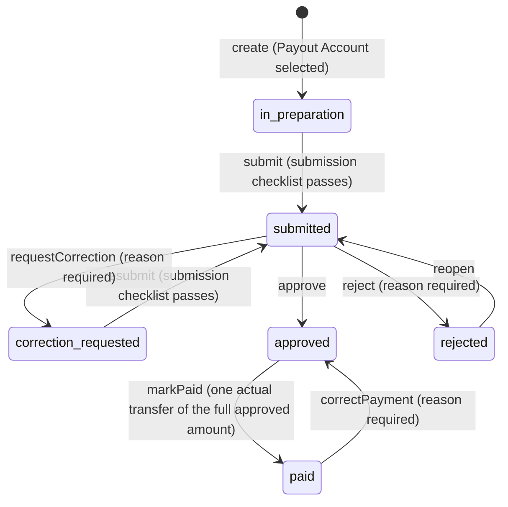

# Claim lifecycle

```mermaid
stateDiagram-v2
    [*] --> in_preparation: create (Payout Account selected)
    in_preparation --> submitted: submit (submission checklist passes)
    correction_requested --> submitted: resubmit (submission checklist passes)
    submitted --> correction_requested: requestCorrection (reason required)
    submitted --> approved: approve
    submitted --> rejected: reject (reason required)
    rejected --> submitted: reopen
    approved --> paid: markPaid (one actual transfer of the full approved amount)
    paid --> approved: correctPayment (reason required)
```
