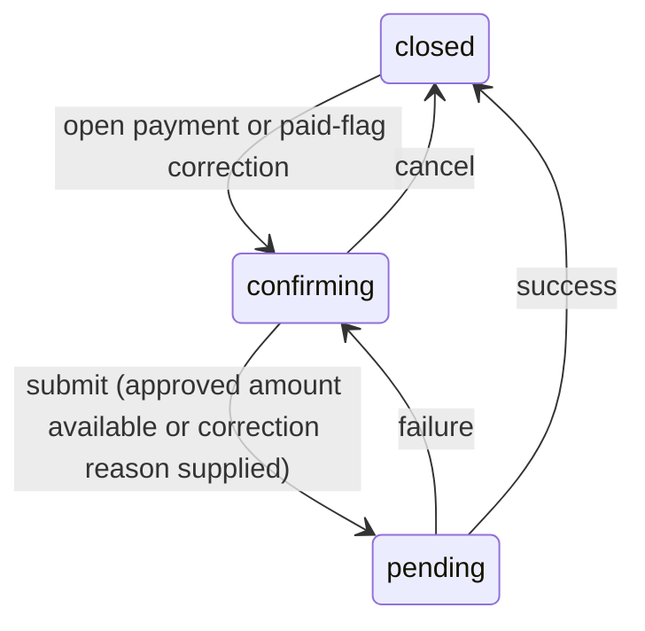

# Payment confirmation

```mermaid
stateDiagram-v2
    closed --> confirming: open payment or paid-flag correction
    confirming --> closed: cancel
    confirming --> pending: submit (approved amount available or correction reason supplied)
    pending --> closed: success
    pending --> confirming: failure
```
